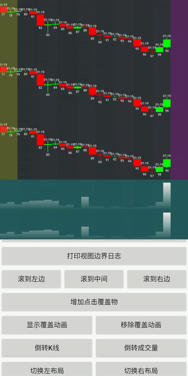
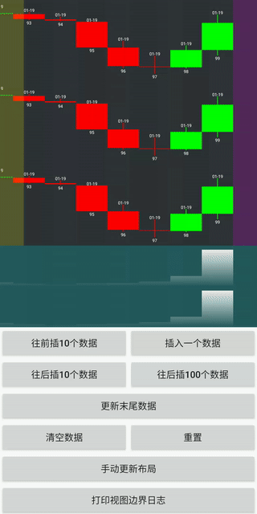
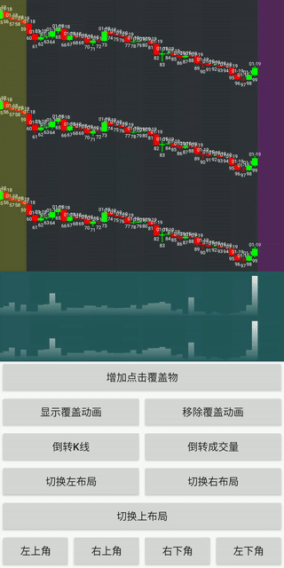

# KlineChart

> 能够实现过渡动画的 k 线库
>
> 目前整体框架已经完成，有待完善和添加 `Drawing`
>
> 如果有需求的可以先行参考现有的 `Drawing` 实现其它指标和绘图业务







#### 基本使用

使用流程：

1. 实现自己的 `Drawing` 并添加到 `RenderCanvas` 中

   ```java
   MainRenderer.CanvasLayoutParams canvasLayoutParams = new MainRenderer.CanvasLayoutParams(0, 0, 1, 3);
   MainRendererCanvas<KlineInfo> mainRenderCanvas = new MainRendererCanvas<>(canvasLayoutParams);
   RendererCanvas.DrawingLayoutParams layoutParams = new RendererCanvas.DrawingLayoutParams();
   layoutParams.setWeight(1);
   layoutParams.setVerticalLinear(true, 1);
   mainRenderCanvas.addDrawing(new CandleDrawing(mCandleIndexRange, layoutParams), true);
   
   layoutParams = new RendererCanvas.DrawingLayoutParams();
   layoutParams.setWeight(1);
   layoutParams.setVerticalLinear(true, 1);
   mainRenderCanvas.addDrawing(new TransitionCandleDrawing(new TransitionIndexRange(mCandleIndexRange), layoutParams), true);
   ```

2. 将 `RenderCanvas` 添加到 `Renderer` 中

   ```java
   viewRender.addRenderCanvas(mainRenderCanvas, MainRenderer.POSITION_MAIN);
   ```

   参考：[Test2Activity](app/src/main/java/com/example/kchartdemo/Test2Activity.java)

#### 常用监听和设置

* 设置padding

  ```java
  mKChart.getPaddingHelper().setRightExtPadding(100, false);
  mKChart.getPaddingHelper().setLeftExtPadding(100, false);
  ```

* 进入离开padding监听

  ```java
  mKChart.setOnPaddingListener
  ```

  

* item相关点击事件

  ```java
  mKChart.getTouchTapManager().setOnSingleSelectedChangeListener
  mKChart.getTouchTapManager().setOnDoubleSelectedChangeListener
  mKChart.getTouchTapManager().setOnLongSelectedChangeListener
  ```

* 到达边界监听

  ```java
  mKChart.setOnMarginListener
  ```

* 回调界面显示的索引范围

  ```java
  mKChart.getTransformer().setOnViewIndexListener(new Transformer.OnViewIndexListener() {
      @Override
      public void viewIndex(int startIndex, int endIndex) {
          Log.e("OnViewIndexListener", "viewIndex: " + startIndex + " -- " + endIndex);
      }
  });
  ```

#### 说明

**整体布局**

分为前景、主体和背景，其中主体内部又分为主视图、左视图、顶视图、右视图和底视图

* 前景 `ForegroundRenderer`
* 主体 `MainRenderer`，内部分为主视图、左视图、顶视图、右视图和底视图
* 背景 `BackgroundRenderer`

**绘制层级**

`Renderer` -> `RendererCanvas` -> `Drawing`

#### 优化

* 有时候同样的计算内容可以用在不同的指标中，这里为了避免重复计算，优化如下：

  1. 继承至 `IndexRange`，并赋予唯一 tag

     ```java
     public class CandleIndexRange extends IndexRange {
         // ...
         @Override
         public String getIndexTag() {
             return "Candle";
         }
         // ...
     }
     ```

  2. 在构建 `Drawing` 时，将 `IndexRange` 同一实例传递进去即可

     ```java
     mCandleIndexRange = new CandleIndexRange();
     new CandleDrawing(mCandleIndexRange, layoutParams)
     new CandleDrawing2(mCandleIndexRange, layoutParams)
     ```

* 善用 `AbstractKChartAdapter` 里的添加数据逻辑，如果要自行实现也请参考该类